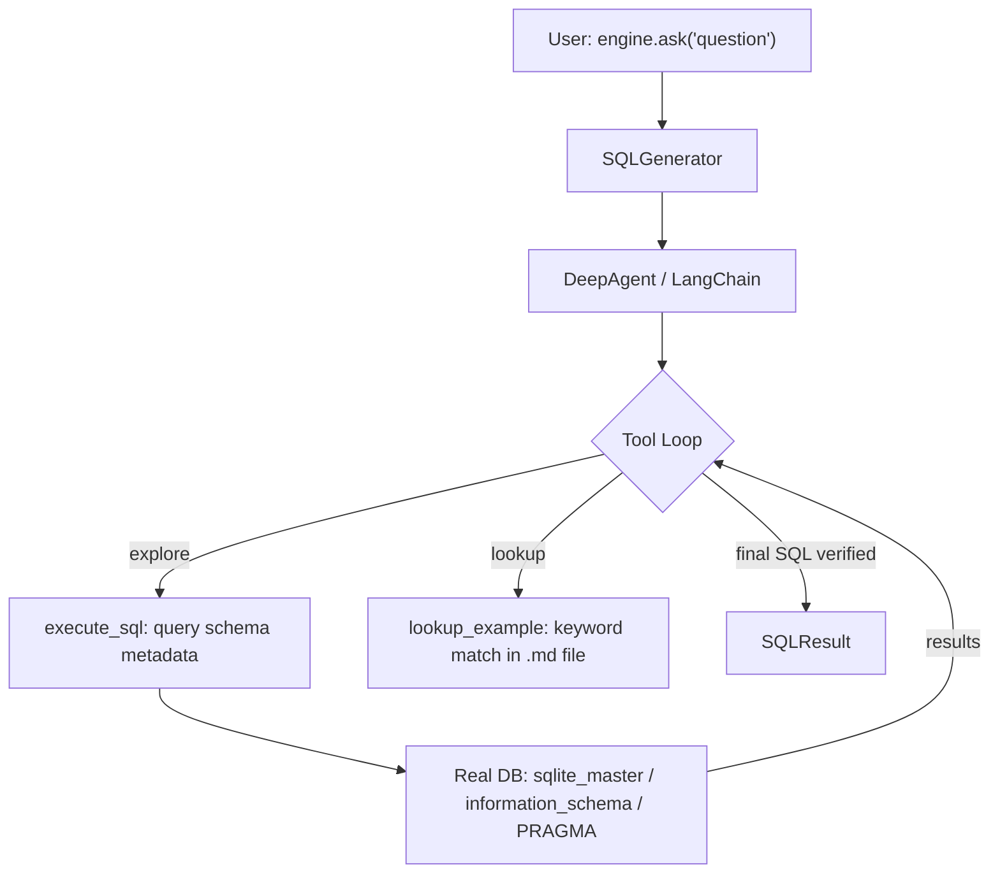

# text2sql — Project Exploration & Architecture Notes

## Step-by-Step Project Exploration

### Architecture in One Diagram



---

### Layer by Layer

#### 1. Entry Point — `text2sql/core.py`

```python
engine = TextSQL("sqlite:///mydb.db")
result = engine.ask("Top 5 customers by revenue?")
```

`TextSQL.__init__` wires together four components:
- `Database` — SQLAlchemy connection wrapper
- `ExampleStore` — optional Markdown-based scenario lookup
- `Tracer` — optional JSONL trace logger
- `SQLGenerator` — the agent that owns the tool loop

---

#### 2. SQL Generation Loop — `text2sql/generate.py`

`SQLGenerator` builds a system prompt with dialect-specific schema-metadata instructions,
then creates a `DeepAgent` pre-loaded with tools. When `ask()` is called:

1. The question is passed to the agent as a `HumanMessage`
2. The agent runs a recursive tool-call loop (up to 50 iterations)
3. The loop ends when the LLM emits a final text message containing a `\`\`\`sql` block
4. That SQL is extracted and executed one final time by `_parse_result()`

The system prompt (`SYSTEM_PROMPT`) embeds the dialect guide and instructs the LLM to:
- **EXPLORE** schema metadata first
- **INSPECT** candidate tables
- **WRITE & EXECUTE** SQL and verify it
- **FIX** errors by reading the error message and retrying

---

#### 3. Tools — `text2sql/tools.py`

| Tool | What it does |
|---|---|
| `execute_sql` | Read-only SQL (SELECT / WITH / PRAGMA / SHOW / DESCRIBE). The LLM uses this for both schema exploration AND running the final query. Destructive statements are blocked by regex. |
| `lookup_example` | Word-overlap keyword search over a `.md` file of business-concept → SQL guidance mappings. Only registered when an `ExampleStore` is provided. |

Security note: `_is_read_only()` strips comments then checks the first keyword and
scans for any destructive DML/DDL pattern before allowing execution.

---

#### 4. Schema Guidance — `text2sql/dialects.py`

Pre-written SQL snippets are injected into the system prompt per dialect,
telling the LLM exactly *how* to query its own catalog:

| Dialect | Metadata source |
|---|---|
| SQLite | `sqlite_master`, `PRAGMA table_info`, `PRAGMA foreign_key_list` |
| PostgreSQL | `information_schema.columns` + `pg_catalog.pg_description` |
| MySQL | `information_schema.columns`, `information_schema.key_column_usage` |
| SQL Server | `sys.tables`, `sys.columns`, `sys.extended_properties` |

The LLM can filter any catalog query with `LIKE`/`ILIKE` to keyword-search
column names — e.g. `WHERE column_name ILIKE '%revenue%'`.

---

#### 5. Example Store — `text2sql/examples.py`

Parses a Markdown file where each `##` heading is a scenario name and the
body explains which tables/columns/joins to use.

```markdown
## net revenue
Net revenue = gross revenue minus refunds.
- `orders.total_amount` is gross
- `refunds.amount` is the refund
- Net = SUM(orders.total_amount) - COALESCE(SUM(refunds.amount), 0)
```

Lookup is **pure keyword/word-overlap matching** — no embeddings, no vector DB.

---

#### 6. Agent Runtime — `text2sql/agent.py`

Wraps LangChain's `deepagents.create_deep_agent`. Supports:
- `anthropic:claude-sonnet-4-6` (default)
- `openai:gpt-4o` (and other OpenAI models)

Context compaction (summarization) is handled automatically by deepagents
for large schemas. `recursion_limit` is set to 50 tool calls per query.

---

#### 7. Analysis Engine — `text2sql/analyze.py`

A purely deterministic (no-LLM) post-hoc pipeline that reads JSONL trace files
and produces:
- `SchemaRecommendation` — tables/columns that should be renamed or commented
- `ExampleSuggestion` — business concepts that would benefit from a new scenario

Accessed via `engine.analyze()`.

---

## How This Differs from Schema-as-Vector-DB

This is the core architectural difference between this project and the
traditional RAG/vector-retrieval approach:

| Dimension | **This project (Live Exploration)** | **Schema-as-Vector-DB** |
|---|---|---|
| **Schema retrieval** | LLM issues SQL at runtime to `information_schema` / `PRAGMA` | Schema is pre-embedded and stored in a vector store (pgvector, Chroma, Pinecone, etc.) |
| **Table selection** | LLM autonomously browses — tries candidates, reads column lists, backtracks if wrong | `SELECT top-k most similar tables` via cosine similarity on the question embedding |
| **Example/scenario matching** | Word-overlap keyword scan of a `.md` file | Question is embedded → nearest-neighbor lookup in vector store |
| **Pre-processing required** | None — only a connection string needed | Must embed all table/column descriptions upfront; must re-embed on schema changes |
| **Staleness problem** | Never stale — schema is read live at query time | Embeddings go stale when tables/columns are renamed or added |
| **Cost model** | More LLM tokens per query (multiple schema-exploration tool calls) | More infrastructure (vector DB, embedding model, sync pipeline) |
| **Accuracy on ambiguous names** | LLM reads actual column names and reasons about them | Depends entirely on the quality of descriptions written at embedding time |
| **Self-correction** | Built-in — if a query fails, the LLM reads the error message and retries | Not possible in a single-pass retrieval pipeline |
| **Schema size limit** | Handles 80+ tables with no special config (agent navigates selectively) | Must tune `top-k` and chunk size; too many tables → irrelevant chunks retrieved |

**The key insight from the README:**
> *"Every guardrail you remove is capability you get back."*

By not pre-filtering schema with a retriever, the LLM can find tables a cosine
search would miss. In the Spider benchmark trace, the agent found `singer_solo`
(which had `Net_Worth_Millions`) even though `singer` was the obvious first
candidate — because it explored both and read the column list of each.

---

## Write-SQL Approach

The `ask()` method uses an **agentic loop** — many tool calls, self-correction,
and runtime schema exploration. The alternative is a **write-sql** (single-pass)
approach: dump the full schema into the prompt once and ask the LLM to produce
SQL in a single call with no tools.

### How `ask()` works (agentic)

```
Question
   │
   ▼
[Tool call 1] SELECT name FROM sqlite_master ...   → list of 80 tables
[Tool call 2] PRAGMA table_info('singer')          → wrong table, no Net_Worth
[Tool call 3] PRAGMA table_info('singer_solo')     → found Net_Worth_Millions
[Tool call 4] SELECT Name FROM singer_solo ORDER BY Net_Worth_Millions ASC
   │
   ▼
Final SQL returned + verified ✓
```

### How `write_sql()` works (single-pass)

```
Question + Full Schema Dump (all tables + columns)
   │
   ▼
[Single LLM call — no tools]
   │
   ▼
SQL returned (not verified against the DB)
```

### Trade-offs

| | `ask()` — Agentic | `write_sql()` — Single-pass |
|---|---|---|
| Schema size | Unlimited (agent navigates) | Limited by context window |
| Token cost | High (multiple tool calls) | Low (one call) |
| Latency | Higher (multiple round-trips) | Lower (one round-trip) |
| Self-correction | Yes — reads errors and retries | No |
| Verified output | Yes — SQL is executed before return | No — SQL may not run |
| Accuracy on large schemas | 95%+ (Spider benchmark) | Degrades with schema size |

### Implementation of `write_sql()`

Add this to `text2sql/generate.py`:

```python
WRITE_SQL_PROMPT = """You are a SQL expert. Given the database schema below, write a single {dialect} SQL query that answers the question.

{dialect_guide_brief}

## Schema

{schema}
{instructions}
## Rules
- Use only table and column names that appear exactly in the schema above.
- Write valid {dialect} SQL.
- Return ONLY the SQL query inside a ```sql code block. No explanation needed.

## Question

{question}"""


def write_sql(self, question: str, execute: bool = False, max_rows: int | None = None) -> SQLResult:
    """Single-pass SQL generation — no tool loop, no schema exploration.

    Dumps the full schema into the prompt and asks the LLM to produce SQL
    in one call. Faster and cheaper than ask(), but:
    - No self-correction if the SQL is wrong
    - Accuracy degrades on large schemas (context window limit)
    - SQL is NOT executed unless execute=True

    Args:
        question:  Natural language question.
        execute:   If True, run the generated SQL and populate result.data.
        max_rows:  Max rows to return (only used when execute=True).

    Returns:
        SQLResult with .sql populated. .data is populated only if execute=True.
    """
    schema_summary = self.db.get_schema_summary()
    schema_text = _format_schema_for_prompt(schema_summary)

    instructions = ""
    if self.instructions:
        instructions = f"\n## Instructions\n{self.instructions}\n"

    # Brief dialect hint (just the syntax note, not the full catalog queries)
    dialect = self.db.dialect
    dialect_guide_brief = _get_dialect_syntax_hint(dialect)

    prompt = WRITE_SQL_PROMPT.format(
        dialect=dialect,
        dialect_guide_brief=dialect_guide_brief,
        schema=schema_text,
        instructions=instructions,
        question=question,
    )

    llm = _get_chat_model(self.model)
    from langchain_core.messages import HumanMessage, SystemMessage
    response = llm.invoke([HumanMessage(content=prompt)])
    response_text = response.content if isinstance(response.content, str) else str(response.content)

    final_sql, commentary = _extract_sql_from_response(response_text)

    error = None
    data = []
    if not final_sql:
        error = f"No SQL produced. Response: {response_text[:300]}"
    elif execute:
        try:
            rows = self.db.execute(final_sql)
            if max_rows is not None:
                rows = rows[:max_rows]
            data = rows
        except Exception as e:
            error = f"Execution failed: {e}"

    return SQLResult(
        question=question,
        sql=final_sql,
        data=data,
        error=error,
        commentary=commentary,
        tool_calls_made=0,
        iterations=0,
    )
```

Add these helpers to `text2sql/generate.py`:

```python
def _format_schema_for_prompt(schema: dict) -> str:
    """Render the schema dict from Database.get_schema_summary() as readable text."""
    lines = []
    for table, info in schema.items():
        comment = f"  -- {info['comment']}" if info.get("comment") else ""
        lines.append(f"Table: {table}{comment}")

        for col in info["columns"]:
            nullable = "" if col["nullable"] else " NOT NULL"
            col_comment = f"  -- {col['comment']}" if col.get("comment") else ""
            lines.append(f"  {col['name']}  {col['type']}{nullable}{col_comment}")

        if info.get("primary_keys"):
            lines.append(f"  PK: {', '.join(info['primary_keys'])}")

        for fk in info.get("foreign_keys", []):
            cols = ", ".join(fk["constrained_columns"])
            ref_cols = ", ".join(fk["referred_columns"])
            lines.append(f"  FK: {cols} -> {fk['referred_table']}({ref_cols})")

        lines.append("")
    return "\n".join(lines)


def _get_dialect_syntax_hint(dialect: str) -> str:
    """Return a one-line syntax note for the dialect (used in write_sql prompt)."""
    hints = {
        "sqlite":     "Use SQLite syntax. String functions: SUBSTR, INSTR, LENGTH.",
        "postgresql": "Use PostgreSQL syntax. String functions: SUBSTRING, POSITION. Use ILIKE for case-insensitive matching.",
        "mysql":      "Use MySQL syntax. Use LIMIT for row caps. Dates: DATE_SUB, DATE_FORMAT.",
        "mssql":      "Use T-SQL syntax. Use TOP instead of LIMIT. Dates: DATEADD, DATEDIFF.",
    }
    return hints.get(dialect, f"Use {dialect} SQL syntax.")
```

Expose it on `TextSQL` in `text2sql/core.py`:

```python
def write_sql(self, question: str, execute: bool = False, max_rows: int | None = None):
    """Single-pass SQL generation without schema exploration or tool calls.

    Args:
        question:  Natural language question.
        execute:   Run the SQL and populate result.data (default False).
        max_rows:  Max rows to return when execute=True.

    Returns:
        SQLResult with .sql populated. Faster than ask() but no self-correction.
    """
    return self.generator.write_sql(question, execute=execute, max_rows=max_rows)
```

### Usage

```python
from text2sql import TextSQL

engine = TextSQL("sqlite:///company.db")

# Fast single-pass — just generate SQL, don't run it
result = engine.write_sql("Top 5 products by total revenue")
print(result.sql)

# Generate AND execute
result = engine.write_sql("Top 5 products by total revenue", execute=True, max_rows=10)
print(result.sql)
print(result.data)
```

### When to use which

| Use `ask()` when... | Use `write_sql()` when... |
|---|---|
| Schema has many tables (10+) | Schema is small and well-known |
| Column names are ambiguous | Column names are self-explanatory |
| Business logic is complex | Query is straightforward |
| Correctness is critical | Speed and cost matter more |
| You need verified, executed SQL | A draft SQL is sufficient |
